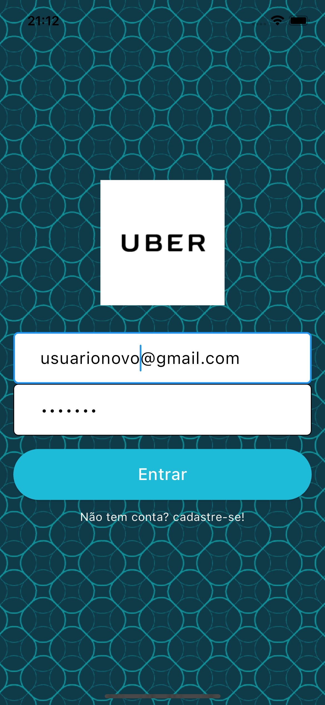
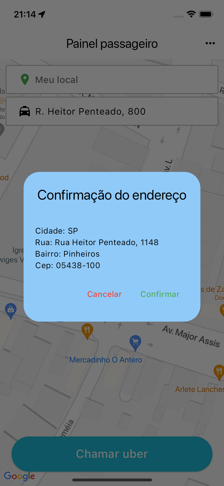

# App "Clone Uber"

## Descrição

Um aplicativo desenvolvido durante o curso de Desenvolvimento Flutter Mobile, com o objetivo de entender e aplicar conceitos fundamentais na criação de um aplicativo similar ao UBER. O projeto utiliza Firebase para gerenciamento de cadastro, autenticação de usuários, banco de dados em tempo real, proporcionando uma experiência prática e completa de desenvolvimento mobile.

## Curso

**Desenvolvimento Android e IOS com Flutter - Crie 15 Apps**

[Link para o curso na Udemy](https://www.udemy.com/course/desenvolvimento-android-e-ios-com-flutter/?couponCode=MCLARENT71824)

## Status do Projeto

- **Concluído:** 12/10/2021
- **Atualizado:** 30/07/2024

## Tecnologias Utilizadas


## Funcionalidades

- Tela de login
- Tela de cadastro (Passageiro/Motorista)
- Tela de solicitar viagem (Passageiro)
- Tela de confirmar solicitação de viagem (Passageiro)
- Tela visualizar solicitações de viagens (Motorista)
- Tela aceitar viagem (Motorista)
- Tela de mapa com localização atual (Passageiro)

## Instalação

Siga os passos abaixo para rodar o projeto localmente:

1. Clone o repositório:
    ```sh
    git clone https://github.com/rafaelleonan/app-flutter-clone-uber.git
    ```
2. Navegue até o diretório do projeto:
    ```sh
    cd app-flutter-clone-uber
    ```
3. Instale as dependências:
    ```sh
    flutter pub get
    ```
4. Configure o Firebase para o seu projeto:
    - Siga as instruções no [Firebase Console](https://console.firebase.google.com/)
    - Adicione os arquivos de configuração `google-services.json` (Android) e `GoogleService-Info.plist` (iOS)

5. Execute o aplicativo:
    ```sh
    flutter run
    ```

## Telas
<p>
  
  
  
  
  
  
  
  
  
  
 </p>